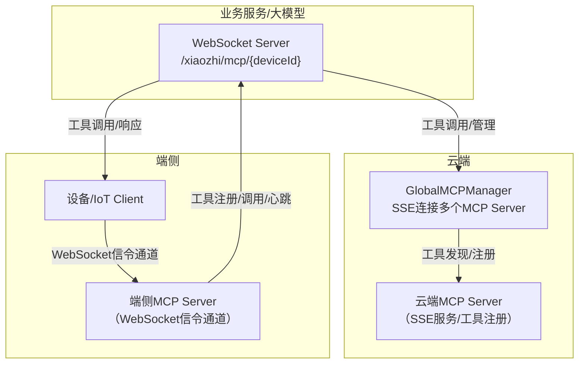

# MCP 功能与逻辑文档

## 1. 概述
MCP（Model Context Protocol）是基于[Eino框架](https://github.com/cloudwego/eino)实现的通用工具管理与调用协议，支持全局和设备维度的工具注册、发现、调用，广泛应用于AI对话、物联网等场景。

## 2. 功能特性
### 🌐 全局 MCP 工具管理
- 支持通过SSE连接多个MCP服务器，实现工具自动发现与注册
- 工具调用代理，统一接口
- 连接状态监控与自动重连

### 📱 设备维度 MCP 管理
- 每个设备独立MCP连接，支持WebSocket协议
- 设备特定工具注册与管理
- 连接数限制与自动清理

### 🔧 Eino 框架集成
- 实现`tool.InvokableTool`接口，支持Eino原生工具调用
- 类型安全、流式处理

## 3. 架构设计



## 4. 配置说明

### config.json 示例
```json
{
  "mcp": {
    "global": {
      "enabled": true,
      "servers": [
        { "name": "filesystem", "sse_url": "http://localhost:3001/sse", "enabled": true }
      ],
      "reconnect_interval": 5,
      "max_reconnect_attempts": 10
    },
    "device": {
      "enabled": true,
      "websocket_path": "/xiaozhi/mcp/",
      "max_connections_per_device": 5
    }
  }
}
```

### 参数说明
| 参数 | 类型 | 说明 |
|------|------|------|
| mcp.global.enabled | bool | 是否启用全局MCP管理器 |
| mcp.global.servers | array | MCP服务器列表 |
| mcp.global.reconnect_interval | int | 重连间隔（秒） |
| mcp.global.max_reconnect_attempts | int | 最大重连次数 |
| mcp.device.enabled | bool | 是否启用设备MCP管理器 |
| mcp.device.websocket_path | string | WebSocket路径前缀 |
| mcp.device.max_connections_per_device | int | 每设备最大连接数 |

## 5. API接口
### WebSocket端点
- 设备MCP连接：
  - `ws://<host>:<port>/xiaozhi/mcp/{deviceId}`
  - 连接后服务器发送初始化消息，客户端响应工具列表，建立双向通信
- 消息格式示例：
```json
{
  "jsonrpc": "2.0",
  "method": "tools/list",
  "id": 1,
  "params": {}
}
```

### REST接口
- 获取设备工具列表：
  - `GET /xiaozhi/api/mcp/tools/{deviceId}`
  - 响应示例：
```json
{
  "deviceId": "device123",
  "tools": {
    "filesystem_read_file": { "name": "read_file", "description": "读取文件内容", "type": "global" },
    "device_sensor_data": { "name": "sensor_data", "description": "获取传感器数据", "type": "device" }
  },
  "globalCount": 5,
  "deviceCount": 3,
  "totalCount": 8,
  "timestamp": 1704067200
}
```

## 6. 典型使用示例
### Go 端调用
```go
// 获取全局工具
manager := mcp.GetGlobalMCPManager()
tools := manager.GetAllTools()
for name, tool := range tools {
    result, err := tool.InvokableRun(context.Background(), `{"path": "/tmp/test.txt"}`)
    if err != nil {
        log.Errorf("工具调用失败: %v", err)
        continue
    }
    log.Infof("工具 %s 结果: %s", name, result)
}
```

### 设备端 WebSocket 连接（JS）
```javascript
const ws = new WebSocket('ws://localhost:8989/xiaozhi/mcp/device123');
ws.onopen = function() { console.log('MCP连接已建立'); };
ws.onmessage = function(event) {
    const message = JSON.parse(event.data);
    if (message.method === 'initialize') {
        ws.send(JSON.stringify({
            jsonrpc: "2.0",
            id: message.id,
            result: {
                protocolVersion: "2024-11-05",
                serverInfo: { name: "device-mcp-server", version: "1.0.0" }
            }
        }));
    }
};
```

## 7. 技术实现要点
- 全局MCP管理器通过SSE与多个MCP服务器连接，自动发现和注册工具，支持断线重连和健康检查。
- 设备MCP管理器为每个设备维护独立连接，支持WebSocket和IoT协议，自动清理离线设备。
- 工具统一实现`InvokableTool`接口，支持参数校验、调用重试、结果格式化。
- LLM集成时，自动获取所有MCP工具并传递给大模型，支持流式响应和工具调用闭环。
- 错误处理健全，支持回退、日志追踪和兼容性保障。

## 8. 故障排查与优化建议
- 检查SSE/WebSocket连接状态，关注日志中的连接、注册、调用错误
- 工具调用失败时，检查参数格式和工具注册情况
- 合理设置重连间隔、最大连接数，定期清理无效会话
- 可扩展权限控制、动态工具启用/禁用、结果回传等高级功能

## 9. 参考资料
- [Eino 框架文档](https://www.cloudwego.io/docs/eino/)
- [MCP 协议规范](https://github.com/mark3labs/mcp-go)
- [SSE 规范](https://developer.mozilla.org/en-US/docs/Web/API/Server-sent_events)
- [WebSocket 协议](https://tools.ietf.org/html/rfc6455)

## 10. 端侧MCP（WebSocket信令通道）

端侧MCP通过WebSocket信令通道与服务器建立连接，实现设备级工具注册、调用和会话管理，适用于边缘设备、IoT场景。

### 典型流程
1. 设备通过 `ws://<host>:<port>/xiaozhi/mcp/{deviceId}` 建立WebSocket连接。
2. 服务器收到连接后，创建/获取对应的设备MCP会话（DeviceMcpSession），并初始化MCP客户端实例。
3. 服务器通过信令通道下发初始化消息，设备端响应并可同步工具列表。
4. 双方可通过JSON-RPC协议进行工具调用、通知、心跳等交互。
5. 连接断开或超时，自动清理会话和资源。

### 主要接口与消息格式
- 连接端点：`ws://<host>:<port>/xiaozhi/mcp/{deviceId}`
- 初始化消息：
```json
{
  "jsonrpc": "2.0",
  "method": "initialize",
  "id": 1,
  "params": { /* ... */ }
}
```
- 工具列表请求：
```json
{
  "jsonrpc": "2.0",
  "method": "tools/list",
  "id": 2,
  "params": {}
}
```
- 工具调用请求/响应、通知等均遵循JSON-RPC 2.0规范。

### 会话与连接管理
- 每个设备ID维护独立的DeviceMcpSession，支持多种MCP连接（WebSocket、IoT等）。
- 支持最大连接数限制、定期心跳（ping）、自动断线检测与清理。
- 断开连接时自动释放资源，保证系统稳定。

### 心跳与断线处理
- 设备和服务器定期发送ping消息，检测连接活性。
- 超过2分钟无心跳则判定为离线，自动断开并清理会话。

### 端云协作
- 端侧MCP适合设备本地工具注册、实时数据采集、边缘AI推理等场景。
- 云端MCP负责全局工具注册、跨设备能力聚合、统一调度。
- 两者可协同为大模型/业务系统提供丰富的工具调用能力。
