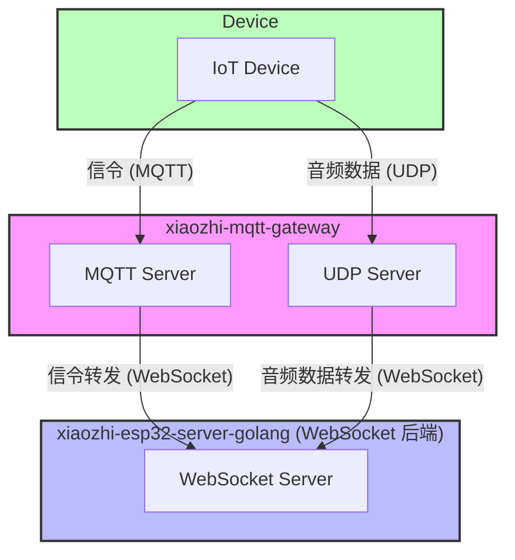

# MQTT UDP Bridge 配置指南

---

### 名词解析

- **xiaozhi-mqtt-gateway:** 虾哥官方 mqtt udp bridge项目，实现了MQTT和UDP协议到WebSocket的转换。该服务允许设备通过MQTT协议进行控制消息传输，同时通过UDP协议高效传输音频数据，并将这些数据桥接到WebSocket服务。[xiaozhi-mqtt-gateway](https://github.com/78/xiaozhi-mqtt-gateway) 
- **xiaozhi-esp32-server-golang:** 本项目

### 整体架构




## 一、MQTT UDP Bridge 配置指南

### 安装步骤
---
1. 克隆仓库
```
git clone 'https://github.com/78/xiaozhi-mqtt-gateway'
cd xiaozhi-mqtt-gateway
```
2. 安装依赖
```
npm install
```
3. 创建配置文件
```
mkdir -p config
cp config/mqtt.json.example config/mqtt.json
```
4. 编辑配置文件 config/mqtt.json，设置适当的参数

### 配置说明
配置文件 config/mqtt.json 需要包含以下内容:
- `chat_servers`：填写 小智golang服务器ip和端口，***path必须为/xiaozhi/mqtt_udp/v1/***
```
{
  "debug": false,
  "development": {
    "mac_addresss": ["aa:bb:cc:dd:ee:ff"],
    "chat_servers": ["ws://192.168.0.100:8989/xiaozhi/mqtt_udp/v1/"]
  },
  "production": {
    "chat_servers": ["ws://192.168.0.100:8989/xiaozhi/mqtt_udp/v1/"]
  }
}
```

### 环境变量
创建 .env 文件并设置以下环境变量:
```
MQTT_PORT=1883              # MQTT服务器端口
UDP_PORT=8884               # UDP服务器端口
PUBLIC_IP=192.168.0.100     # 服务器公网IP

#MQTT_SIGNATURE_KEY=mqtt_key # mqtt key, 可选，如果配置则进行mqtt认证，需与 websocket服务器配置的key相同
```

### 运行

##### 开发环境

```
# 直接运行
node app.js

# 调试模式运行
DEBUG=mqtt-server node app.js
```

---

## 二、小智golang后端服务配置指南


### 1. 关键配置项说明

#### 关闭 本地 MQTT 和 UDP服务器
```json
"mqtt": {
  "enable": false,
  "broker": "127.0.0.1",
  "type": "tcp",
  "port": 2883,
  "client_id": "xiaozhi_server",
  "username": "admin",
  "password": "test!@#"
}
```

#### OTA 配置（设备通过 OTA 获取连接参数）
- `ota.signature_key`: 需要与xiaozhi-mqtt-bridge中的 .env文件中***MQTT_SIGNATURE_KEY***相同
- `test`/`external`：内外网环境区分
- `websocket.url`：返回的WebSocket 服务地址
- `mqtt.endpoint`：MQTT 服务地址和端口
- `mqtt.enable`：是否启用 MQTT（true 时设备优先用 MQTT+UDP）


```json
"ota": {
  "signature_key": "mqtt_key",
  "test": {
    "websocket": { "url": "ws://192.168.208.214:8989/xiaozhi/v1/" },
    "mqtt": { "enable": true, "endpoint": "192.168.208.214:5883" }
  },
  "external": {
    "websocket": { "url": "wss://www.tb263.cn:55555/go_ws/xiaozhi/v1/" },
    "mqtt": { "enable": true, "endpoint": "mqtt.youdomain.cn" }
  }
}
```
---

## 三、参考文档
- [mqtt_udp.md](./mqtt_udp.md)（详细架构、配置、流程）
- [mqtt_udp_protocol.md](./mqtt_udp_protocol.md)（协议与数据流程）
- [config.md](./config.md)（配置项详细说明）
