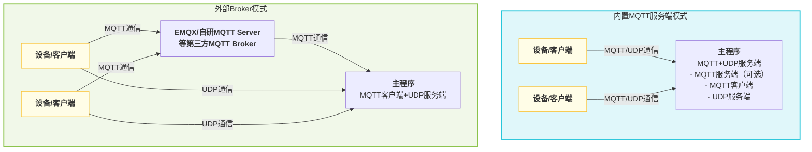

# mqtt udp服务器配置流程

本项目实现了**自有的 MQTT+UDP 服务端**，用于高效处理设备与服务器之间的音频等数据传输。架构灵活，支持多种部署和替换方式，适应不同业务场景。

## 1. 架构特点与灵活性

- **自研 MQTT+UDP 服务端**：项目内置了完整的 MQTT 协议服务端和 UDP 音频通道，支持设备通过 MQTT 建立会话，后续数据走 UDP，兼顾可靠性与实时性。
- **MQTT 服务端可选部署方式**：
  - 可作为主程序（server）的一部分随主进程启动，适合一体化部署。
  - 也可单独部署为独立进程，便于横向扩展和资源隔离。
- **支持第三方 MQTT 服务端**：
  - 项目架构支持将内置 MQTT 服务端替换为如 EMQX、或自研MQTT Server等第三方 MQTT Broker。
  - 只需在配置文件中调整 `mqtt` 相关参数，主程序即可作为纯客户端对接外部 Broker，适合大规模集群和高可用场景。
- **支持 虾哥官方 xiaozhi-mqtt-gateway 项目接入**
  - 适配了虾哥 xiaozhi-mqtt-gateway 开源项目，可以接入使用
  - [详见 mqtt_bridge.md](./mqtt_bridge.md)

### 部署架构图

下图展示了两种典型部署方式，帮助理解项目的灵活架构：



**说明：**
- <b>内置MQTT服务端模式</b>：主程序集成MQTT服务端和UDP服务端，设备直接与主程序通信。
- <b>外部Broker模式</b>：主程序仅作为MQTT客户端连接EMQX、或自研MQTT Server等外部Broker，设备通过Broker转发MQTT消息，UDP数据仍直连主程序。

## 2. 配置文件设置
在 `config/config.json` 中，需关注以下参数：
- `mqtt`：**客户端角色**，用于配置本服务作为 MQTT 客户端连接到 Broker（无论是内置还是外部 Broker）。
  - `broker`、`type`、`port`、`client_id`、`username`、`password`
- `mqtt_server`：内置 MQTT 服务端参数（仅主程序内置时需启用）
  - `enable`、`listen_host`、`listen_port`、`tls` 等
- `udp`：UDP 通道参数
  - `external_host`、`external_port`、`listen_host`、`listen_port`

## 3. OTA相关配置

OTA（Over-the-Air）配置用于设备远程获取服务器、MQTT、WebSocket等连接信息，以及固件升级、激活等参数。根据设备网络环境（如内网/公网），可自动返回不同的OTA配置信息。

- 配置位置：`config/config.json` 的 `ota` 字段。
- 典型结构：
  ```json
  "ota": {
    "test": {
      "websocket": {
        "url": "ws://192.168.208.214:8989/xiaozhi/v1/"
      },
      "mqtt": {
        "enable": false,
        "endpoint": "192.168.208.214"
      }
    },
    "external": {
      "websocket": {
        "url": "wss://www.tb263.cn:55555/go_ws/xiaozhi/v1/"
      },
      "mqtt": {
        "enable": false,
        "endpoint": "www.youdomain.cn"
      }
    }
  }
  ```
- 主要参数说明：
  - `test`：内网/测试环境下的OTA返回信息。
  - `external`：公网/生产环境下的OTA返回信息。
  - `websocket.url`：设备通过OTA获取的WebSocket服务地址。
  - `mqtt.endpoint`：设备通过OTA获取的MQTT服务器地址。
  - `mqtt.enable`：是否启用MQTT（如需动态切换可用）。
- 典型用途：
  - 设备首次启动或升级时，通过OTA接口获取最新的服务器连接信息和固件信息。
  - 支持根据设备IP自动区分内外网，返回不同的连接参数，便于测试和生产环境隔离。

**注意事项：**
- OTA接口通常为 `/xiaozhi/ota/`，需在WebSocket服务端开放对应路由。
- 设备需在请求头中带上 `Device-Id` 和 `Client-Id`。
- 可结合激活机制，返回激活码、挑战码等信息，提升设备安全性。

## 4. 启动与运行流程

1. **服务初始化**  
   启动主程序时，自动按配置初始化 WebSocket、MQTT Server（可选）、以及 mqtt udp 服务。
2. **MQTT+UDP 服务启动流程**  
   - 读取配置文件中的 mqtt、udp 参数。
   - 若 `mqtt_server.enable=true`，则启动内置 MQTT 服务端，否则仅作为客户端连接外部 Broker。
   - 启动 UDP 服务器，监听 `udp.listen_port`，对外暴露 `udp.external_host:external_port`。
   - 创建 MQTT 客户端（**客户端角色**），连接到配置的 Broker。
   - 客户端通过 MQTT 发送 `hello` 消息，服务器响应并建立 UDP 会话，后续音频等数据通过 UDP 通道传输。

## 5. 配置示例

**内置 MQTT 服务端模式**（一体化部署）
```json
"mqtt": {
  "broker": "127.0.0.1",
  "type": "tcp",
  "port": 2883,
  "client_id": "xiaozhi_server",
  "username": "admin",
  "password": "test!@#"
},
"mqtt_server": {
  "enable": true,
  "listen_host": "0.0.0.0",
  "listen_port": 2883
},
"udp": {
  "external_host": "127.0.0.1",
  "external_port": 8990,
  "listen_host": "0.0.0.0",
  "listen_port": 8990
},
"ota": {
  "test": {
    "websocket": {
      "url": "ws://192.168.208.214:8989/xiaozhi/v1/"
    },
    "mqtt": {
      "enable": false,
      "endpoint": "192.168.208.214"
    }
  },
  "external": {
    "websocket": {
      "url": "wss://www.tb263.cn:55555/go_ws/xiaozhi/v1/"
    },
    "mqtt": {
      "enable": false,
      "endpoint": "www.youdomain.cn"
    }
  }
}
```

**对接外部 MQTT Broker（如 EMQX/自研MQTT Server）**
```json
"mqtt": {
  "broker": "emqx.example.com",
  "type": "tcp",
  "port": 1883,
  "client_id": "xiaozhi_server",
  "username": "admin",
  "password": "test!@#"
},
"mqtt_server": {
  "enable": false
},
"udp": {
  "external_host": "公网IP",
  "external_port": 8990,
  "listen_host": "0.0.0.0",
  "listen_port": 8990
},
"ota": {
  "test": {
    "websocket": {
      "url": "ws://192.168.1.100:8989/xiaozhi/v1/"
    },
    "mqtt": {
      "enable": false,
      "endpoint": "192.168.1.100"
    }
  },
  "external": {
    "websocket": {
      "url": "wss://emqx.example.com/go_ws/xiaozhi/v1/"
    },
    "mqtt": {
      "enable": false,
      "endpoint": "emqx.example.com"
    }
  }
}
```

## 6. 推荐场景
- **一体化部署**：适合中小规模、单机或容器化场景，配置简单，维护方便。
- **分布式/集群部署**：推荐关闭内置 MQTT 服务端，采用 EMQX 等高可用 Broker，主程序仅作为客户端对接，便于弹性扩展和负载均衡。

---

**简要流程**：配置文件设置 → 服务启动自动加载配置 → 启动UDP监听和MQTT连接 → 客户端通过MQTT hello建立UDP会话。

## 7. 对接EMQX等第三方MQTT服务器的Topic定义与映射

在对接EMQX等第三方MQTT Broker时，需遵循如下Topic定义和映射规则，以确保设备与服务端的数据通信顺畅：

### 设备端Topic定义
- **public**: `device-server`  
  > 设备端发布消息时，实际服务端会自动将其映射为 `/p2p/device_public/{mac_addr}`，其中 `{mac_addr}` 为设备的MAC地址。
- **sub**: `null`  
  > 设备端无需主动订阅，服务端会自动为其订阅 `/p2p/device_sub/{mac_addr}`。

### 服务端Topic定义
- **public**: `/p2p/device_sub/{mac_addr}`  
  > 服务端向指定设备下发消息时，需发布到该Topic。
- **sub**: `/p2p/device_public/#`  
  > 服务端需订阅该通配符Topic，以接收所有设备上报的消息。

#### Topic映射说明
- 设备端与服务端的Topic采用自动映射机制，设备只需关注`device-server`，无需关心实际的P2P路径，服务端会根据设备MAC地址自动完成Topic转换。
- 该机制便于大规模设备管理和消息隔离，提升系统安全性和可维护性。

#### 示例
- 设备A（MAC: 11:22:33:44:55:66）
  - 设备端发布：`device-server` → 实际服务端收到：`/p2p/device_public/11:22:33:44:55:66`
  - 服务端下发：`/p2p/device_sub/11:22:33:44:55:66`

- 服务端订阅：`/p2p/device_public/#`，可接收所有设备的上报消息。

> **注意：**
> - 以上Topic映射规则仅在对接EMQX等第三方MQTT Broker时生效。
> - 若使用内置MQTT服务端，Topic可根据实际需求自定义。

## 8. MQTT UDP 数据流程

本节简要介绍设备与服务器之间通过 MQTT+UDP 进行数据交互的整体流程，包括会话建立、数据上报与下发等关键步骤。

详细协议与数据包格式请参考：[MQTT UDP 协议与数据流程文档](./mqtt_udp_protocol.md)

### 流程概述
1. **设备启动**，通过 MQTT 连接服务器，发送 `hello` 消息。
2. **服务器响应**，建立 UDP 会话，分配会话参数。
3. **音频/数据上报**：设备通过 UDP 通道高效上传音频等数据。
4. **服务器下发指令**：如需下发控制指令，可通过 MQTT 或 UDP 通道完成。
5. **会话维护与关闭**：支持心跳、超时检测等机制，保障连接稳定。

> 详细的 Topic 设计、数据包结构、状态流转等请查阅 [mqtt_udp_protocol.md](./mqtt_udp_protocol.md)。
