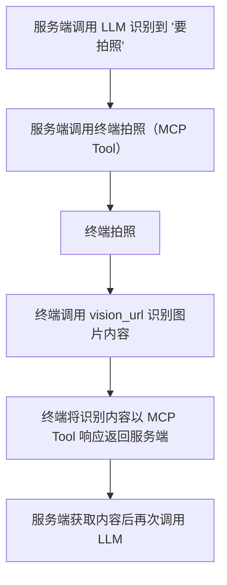

# 视觉识别配置流程及说明

## 1. 功能简介

本系统支持视觉识别功能，主要通过调用外部视觉识别服务（如阿里云 Qwen-VL、火山豆包 Vision 等）实现图像理解、内容识别等能力。相关参数可通过配置文件灵活调整。

## 2. 配置文件位置

视觉识别相关配置文件位于：

- `config/config.json`：主配置文件，包含 vision 相关参数。

## 3. 主要参数说明

`config/config.json` 中 vision 配置示例：

```json
"vision": {
  "enable_auth": false,
  "vision_url": "http://192.168.208.214:8989/xiaozhi/api/vision",
  "vllm": {
    "provider": "aliyun_vision",
    "aliyun_vision": {
      "type": "openai",
      "model_name": "qwen-vl-plus-latest",
      "base_url": "https://dashscope.aliyuncs.com/compatible-mode/v1",
      "api_key": "api_key",
      "max_token": 500
    },
    "doubao_vision": {
      "type": "openai",
      "model_name": "doubao-1.5-vision-lite-250315",
      "api_key": "api_key",
      "base_url": "https://ark.cn-beijing.volces.com/api/v3",
      "max_tokens": 500
    }
  }
}
```

- `enable_auth`：是否启用视觉识别接口的鉴权。
- `vision_url`：**返回给客户端用于图片识别的 HTTP 请求地址**，客户端通过该地址上传图片并获取识别结果。
- `vllm.provider`：指定当前使用的视觉识别服务（如 aliyun_vision、doubao_vision）。
- `aliyun_vision`/`doubao_vision`：各大视觉识别服务的接入参数，包括：
  - `type`：API 类型（如 openai 兼容接口）。
  - `model_name`：所用视觉识别模型名称。
  - `base_url`：服务 API 地址。
  - `api_key`：服务访问密钥。
  - `max_token`/`max_tokens`：最大 token 数。

## 4. 配置流程

1. 根据实际需求，选择并注册所需的视觉识别服务（如阿里云、火山豆包等），获取 API Key。
2. 编辑 `config/config.json`，在 `vision` 字段下填写 vision_url、provider 及对应服务的参数。
3. 启动服务，检查日志确认视觉识别模块加载成功。
4. 通过 API 或前端页面上传图片，验证识别效果。

## 5. 常见问题与排查

- **接口访问失败**：检查 `vision_url` 是否正确，服务是否启动。
- **鉴权失败**：如启用鉴权，需检查 `api_key` 是否正确、有效。
- **识别结果异常**：确认 provider 及模型名称填写无误，API Key 有效，外部服务可用。

---

如需补充具体的 API 调用方式、前端集成说明或特定视觉识别服务的配置，请联系开发者。

## 6. 典型流程步骤与流程图

### 步骤说明
1. 服务端调用 LLM，识别到用户意图为"要拍照"。
2. 服务端通过 MCP Tool 向终端下发拍照指令。
3. 终端收到指令后进行拍照。
4. 终端将拍摄的图片通过 vision_url 进行图片内容识别。
5. 终端将识别到的图片内容以 MCP Tool 响应的方式返回给服务端。
6. 服务端获取到拍照及识别结果后，可再次调用 LLM 进行后续处理。

### 流程图

